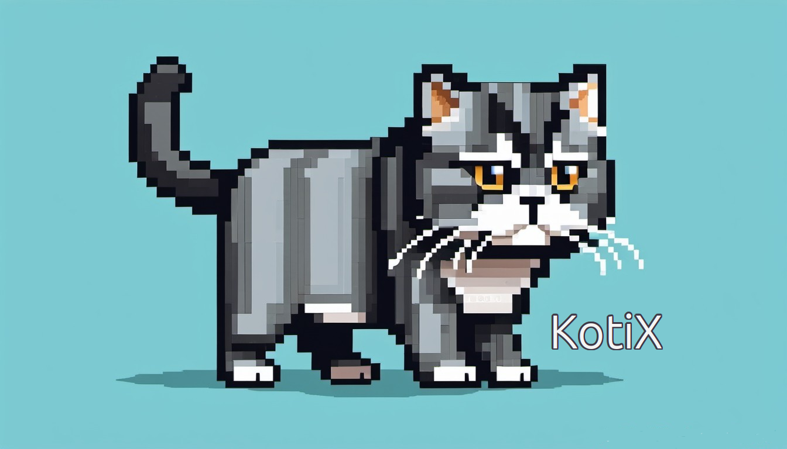

# KotiX

Kotix is a custom AI-powered with LLM support distributive for development.

https://github.com/ollama/ollama

To run and chat with Llama 3.1:
`ollama run llama3.1`

Based on Debian 12
[Main page](https://nolfgk.github.io/KotiX/)

Telegram chat:

Release notes:

- 01-09-2024 - 24.09 version released
    - base image updated to debian 12.7 - bookworm
    - added ollama for llm support
    - added custom art for neofetch
- 01-07-2024 - 24.06 gnome version released
    - intellij idea removed from iso image to reduce size
    - base image updated to debian 12.6 - bookworm
    - fix distributive name in sources
    - added psensor
    - added neofetch
    - added kolourpaint
- 17-06-2024 - alfa version released
    - added jdk
    - added git
    - intellij idea
    - telegram-desktop
    - flatpack